去年夏天出了一部赛车电影，反响出人意料地好，连我身边一年只进两次电影院的朋友都上头了， 全城寻找场次n刷，且丝滑入坑了这个集竞技体育，商业表演，秀场，培养皿为一体的一级方程式，或F1，或四轮。本周2026赛季就正式开始了，因此我必须抓紧时间蹭上热度。

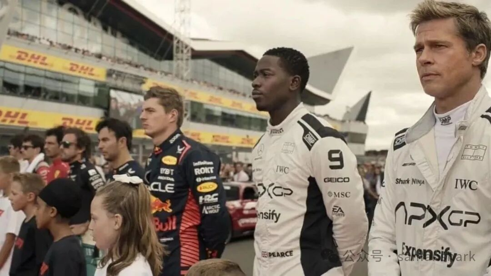
*F1 Movie (2025)*
如果你想要认识车手，看懂比赛，加入梗讨论，那么请放心，这篇文章完全帮不到你，请移步村长托马斯或油管P1，Rick等博主的安利视频与播客，我只想与所有打算在本周末看22位男性富翁开着声音越来越像老翁咳嗽的小车跑圈的读者们讨论：如何观看这一项极不道德——几乎算得上最不道德的赛事。读者们不用担心，除了对F1的尖酸讽刺和合理痛骂之外，此文依旧是安利贴。笔者是一个会准时收看排位赛和正赛，偶尔收看冲刺赛，绝不吝啬表达我对车手们(尤其是维斯塔潘)的喜爱的观众，因此会在文末话锋一转，开始包饺子。

##能有多糟？
在包意大利饺子之前先消极一下：F1运动能有多糟？和有手就行/有脚就行的三大球运动不一样，赛车运动的「车」就是一道过滤器，一上来就筛掉了那些根本没有机会和「车」打交道的人，因此，无论再怎么强调曼塞尔、汉密尔顿、莱科宁、奥康们的平凡出生，F1始终还是与「精英」绑定的，更准确一点，白男精英。足球世界里最喜闻乐见的「从贫民窟到百万富翁」的故事在围场——尤其是如今的围场里——越来越难发生，在愈发规模化和专业化的行业里，培养车手需要的是科学的模式，大量的资金投入，甚至家长鸡娃的masterplan，这些极高的门槛无法带来民主，围场无论如何表演，最终只能是一个极小的、建立在各种历史原罪之上的人上人俱乐部。

###搞点复古的种族主义
这个俱乐部最大的特点就是白。有人会说哪里白了，F1电影中专门选了黑人演员Damson Idris给布拉德皮特作配角，对路人而言最有名的F1赛车手，历史最佳车手之一汉密尔顿也是英国牙买加混血的黑人，这些看起来都很伟光正。但事实是这一位黑人车手就是赛事历史上唯一一位黑人车手了，并且当这个黑人想要推动Black Lives Matter运动或者增加行业多样性时，等待他的却是保守主义最擅长无声阻力。

与和F1并称世界三大体育赛事的FIFA世界杯、奥运会相比，F1种族歧视相当嚣张，改变相当缓慢。

在声援BLM运动时，英足总，欧足联等等协会——无论出于真心还是表演，至少都会进行某种仪式表示支持。而汉密尔顿作为当时围场最多荣誉的车手，想要对此进行表态声援时，围场氛围却出奇地尴尬，前 F1 掌门人Bernie Ecclestone甚至在采访中说出了「汉密尔顿的行动没有用」「在很多情况下，黑人比白人更种族歧视」等奇葩发言。前世界冠军，维斯塔潘的现老丈人皮奎特也用侮辱性词语称呼过汉密尔顿，他谈到其他车手时都称其名，唯独谈到老汉时称他为「neguinho」，已经21世纪20年代了，老登们还能如此舒服自洽地说出这种石器时代种族歧视言论，正说明了围场对于种族歧视的态度是多么宽容且落后。

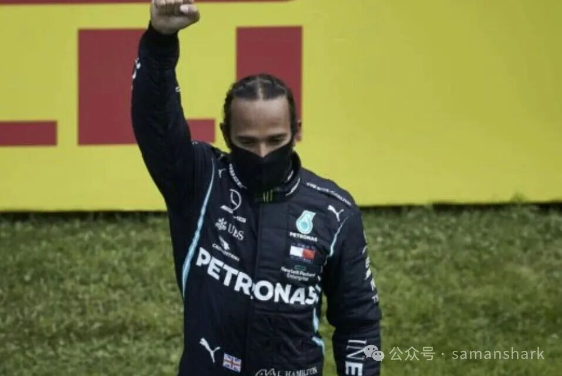
*汉密尔顿颇为谨小慎微的行动竟被称为「激进种族主义」*

围场内的老保——Bernie Ecclestone，红牛马尔科为主的有毒老登，皮奎特为主的被加上滤镜的老一辈车手，以及当下渗透F1大获成功的中东财团们，皆对种族议题生恶痛绝，问就是「带上头盔后车手是没有种族之分的」——然而在整个F1提供的4万个工作岗位中黑人连1%都不到；再问就是「只谈速度不谈政治」——这些说法和「体育无关政治」一样愚蠢。一切都是有关政治的，能够信誓旦旦说出这话的并信以为真的人正是那些没有受过政治之苦的，从来没被基于种族或国籍的系统性不公压身的轻松白男。

由于日本的赛车文化浓厚，在汉密尔顿进入围场的几十年前，围场就有了第一位亚洲车手，但到了2024年，中国车手周冠宇失去了正式车手席位，2025年，日本车手角田裕毅失去了正式车手席位，第一位亚洲车手中嶋悟登场的近40年后，围场竟只剩一口正宗英国腔的英泰混血车手阿尔本来做半个亚洲代表。离开的这两位亚洲年轻车手声量没有荣誉傍身的汉密尔顿大，但是围场老保对于他们的歧视也是更微妙，伪装得更好的。
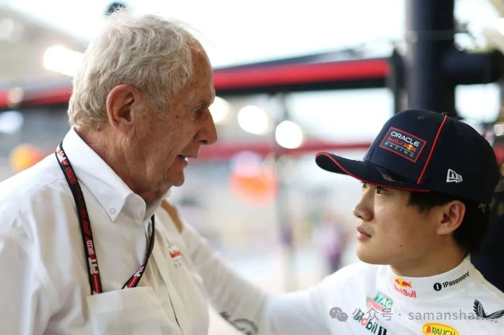
*人形僵尸马尔科（左）和角田裕毅*

角田是红牛系的车手，在小红牛一直很稳，但并不被马尔科这个种族歧视者看好。2025年他季中加入大红牛，表现不尽如人，最终在赛季结束后失去席位。我对他本人无感，但一直非常厌恶围场内外给他贴的标签。媒体在报道他时经常强调他的「小巧」「可爱」，甚至在采访中提出一些带有冒犯性的关于身高的玩笑。这在本质上是一种矮化，在崇尚雄性激素的保守主义文化中，身材就是一种领袖气质，传统男子气概的象征，如今这个亚洲人尽管车技高超，但依旧是可爱迷你的，正符合亚洲人「无威胁」的刻板印象。而性格更平和的周冠宇是更无威胁的，他从某种程度上还不幸贴合了「模范少数族裔」形象，温和，安静，在赛场上和媒体中的存在感都低得离谱。

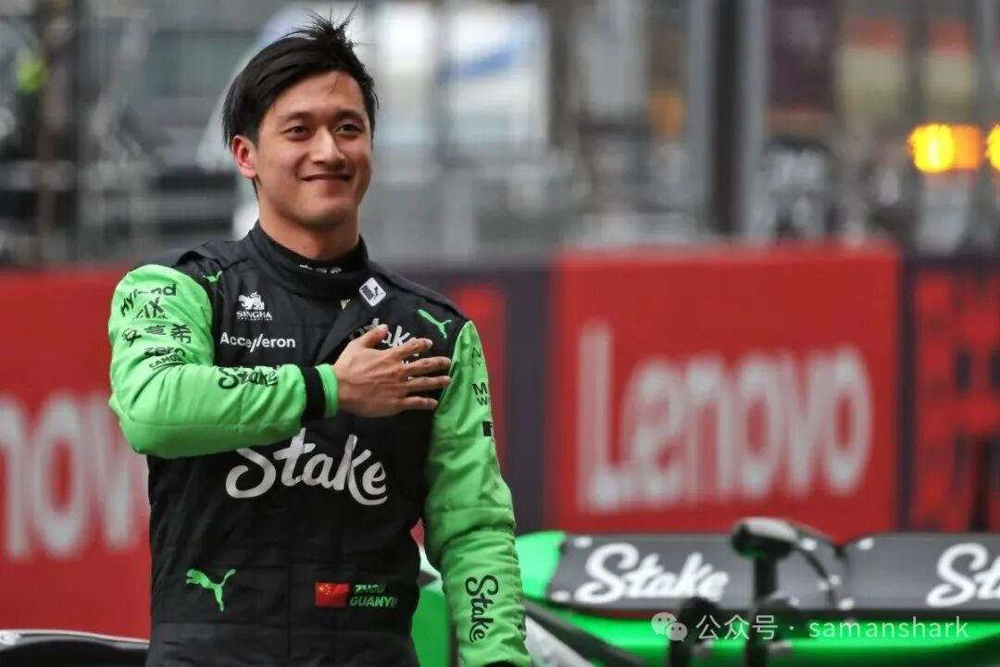
*周冠宇在围场三年，名字总是被同事叫成「zoo」「Joe」，自由媒体和FIA公关团队真的注意到这种微歧视吗*

角田的「暴躁」也是一个被萌宠化的标签，同样是脾气暴躁嘴巴脏，围场对早年维斯塔潘的批评中始终带着一点对他求胜心切的理解，「有个性」「硬汉」「大反派」，云云，而同样讲脏话，脾气爆，且车技也并不赖的角田则只能被包装为一个愤怒的小孩。这种叙事懒惰又歹毒，其实角田的语言习惯正能够体现如今体育世界，尤其围场之中根生蒂固的语言霸权。他作为日本天才车手初到英国时住在Milton Keynes，整天和蓝领技师混，捡来了一嘴非常实用的英式脏话，红牛领队霍纳都开玩笑说角田当时生活在盖里奇的黑帮电影里。有过外语学习经验的读者可能会有这样的体验，在说外语时自己好像变了一个人，哪怕沟通顺畅也无法像讲母语时那样清晰自然地表露出自己的全部性格。日本并非荷兰比利时这种英语普及率高的国家，角田在使用这种被动学习的语言时候，他原本鲜活的、受母语文化滋养的灵魂就不得不接受某种异化与重塑，成为英语母语者眼中某种具有违和感或反差萌的吉祥物，一个在皮包里哇哇叫的吉娃娃。

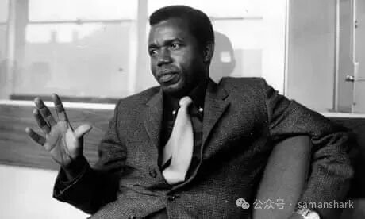
*Chinua Achebe: 一个非洲人能够把英语学得足够好并有效地用于创作吗？关于该问题，我的回答一定是可以的。如果你从另一个方面发文：他能够学得好像一个母语者那样吗，我会说，我希望他不能够*

我在荷兰的酒吧中看比赛时发现了一个规律，在外来移民较多的大城市和土耳其裔、摩洛哥裔聚集区的酒吧，电视里放的基本是英超法甲，而白人浓度过高的村镇，以及那些看着就不敢进去的全白人酒吧里播放的往往都是F1和其各种衍生节目。的确，无论F1再怎么高呼 we race as one，至少在肉眼可见的未来，F1围场和新一季的SNL会越来越相似：招人喜欢的亚裔男离开了，剩下唯一老资历非裔男，其余全都是白人和临时工，任凭愈发保守的一言堂老登开倒车。

###全（直）男班，是不是很大胆？

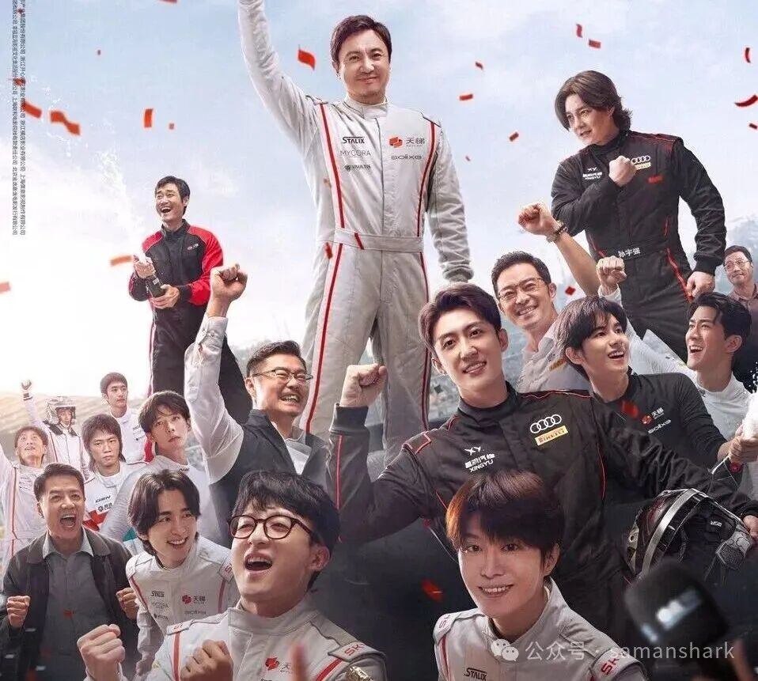
*中了阳毒*

F1从来没有标榜是「男子方程式赛车」，但自从创立到现在其实多年就几乎没有出现女车手的身影，出现的更多的反而是如今已成绝版形象的「赛车女郎」。2018年，自由媒体宣布取消赛道上这些穿着性感清凉的举牌女郎，这让很多提到车必然想起车模的老观众们怒喊「女权盯上F1了」。自由媒体和F1做此决定肯定不是因为忽然间朴素的女性主义觉醒，决定要反对物化女性了。F1 的女性观众比例急速攀升——近年来尤其迅速，光从AO3上四轮同人文的新增数量就能看出一二，有基本形象顾虑的企业都会在社会责任的压力下表明态度，摆脱物化女性的嫌疑。无论国际汽联(FIA)的初衷是纯商业驱动还是心不甘情不愿，至少就结果来看，作为女观众的我是满意的。

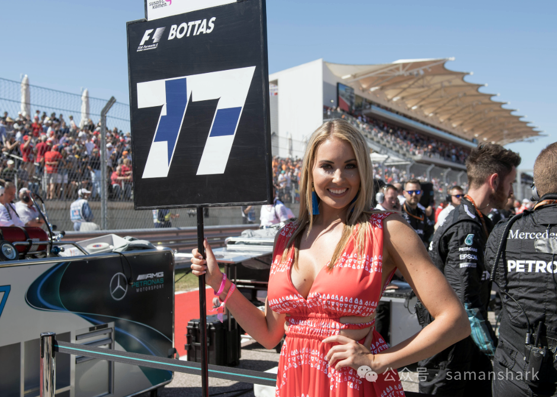
*举着牌子的赛车女郎*

F1历史其实也出现过参加大奖赛的女车手，比如50年代靠贵族身份参加了比利时大奖赛并获得第 10 名的女车手菲利皮丝，但在法国站时她就遭遇了赛事总监的禁止，并遭遇了一句臭名昭著的歧视言论，「女人唯一应该戴的头盔，是在理发店里的那种。」——老黄历的性别之战我们不展开讨论，只说现在：维斯塔潘的老妈年轻时是个卡丁车手，能在卡丁车上和后来的F1男车手们打得有来有回，被说过是个车技极高的天才选手，但她早早选择退出，和老潘结婚生娃了，因此这个大女主故事只能存在于想象中。梅奔领队马桶狼的妻子苏西狼是现代F1第一位参加官方练习赛的女性。她在德国房车大师赛为梅赛德斯效力多年，并在2012年成为威廉姆斯的开发车手。2014年，她代表威廉姆斯跑了两次练习赛，与队友马萨只差了0.2秒，完全具备驾驶 F1 的速度。2015年，当时还在威廉姆斯的博塔斯受伤无法参赛，车队没有选择作为储备车手的苏西，而是临时找来老将苏蒂尔，这也是苏西离正式席位最近的一次了。

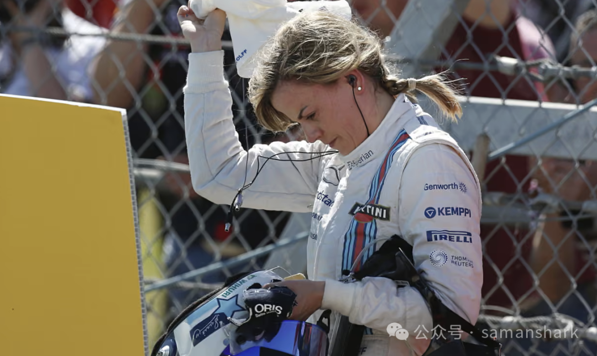
*作为威廉姆斯储备车手的苏西狼备受争议 (Susie Wolff)*

苏西近年来最大的动作是建立了全女性车手的F1学院，隶属于F1官方。这确实是好事一件，要求所有F1车队必须各自赞助并涂装一名F1 Academy车手，试图从制度上拉女车手入局。但我个人对此项目持悲观态度，F1学院不伦不类的尴尬定位让它很难成为女车手们的晋升通道，学院的冠军很难直接获得足够的积分晋升F3或F2，更别说升至F1。如果真的又一个天才女车手出现了，在F1学院里大杀四方，她的成就也仅仅会被看成隔离后的性别内部的胜利，然后在低等级组里消耗职业生命，几乎不可能像维斯塔潘那样接连跳级，绿灯大开升上F1。WSeries的三连冠查德威克如今就是这样，她在女子组已经无敌了，但是由于WSeries的积分制度不被FIA完全认可，她依然拿不到进入F1所需的超级驾照积分。

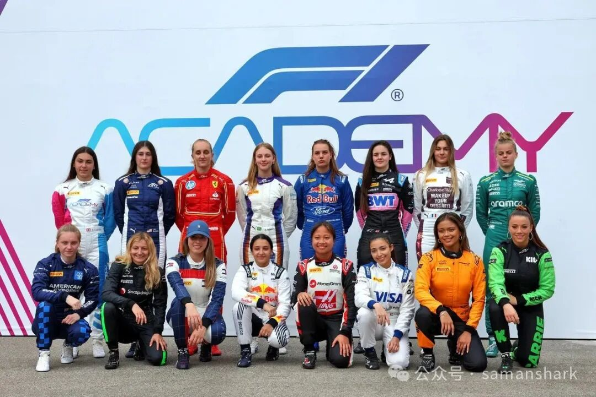
*2025年F1学院年级合照*

去年，梅奔的Pin姐获得了F1学院的冠军，体感其音量比前几年打了不少，2026年，Pin也成为了梅奔的发展车手——排在储备车手Vesti之后，如果某周末拉塞尔和安东内利忽然去做阑尾炎手术，另外两位发展车手杜尔克森和戴维森未战先怯，Pin终于就可以驾驶梅奔在F1的赛场转圈圈了。这是个可能性为0的假设，F1做出的各种不痛不痒的「进步」改动无法掩盖其腐朽落后的性别意识，就像种族主义者能以最小的代价在围场内最大程度享受其言论自由，挤满了厌女者的围场环境不可能真正做到女性友好:

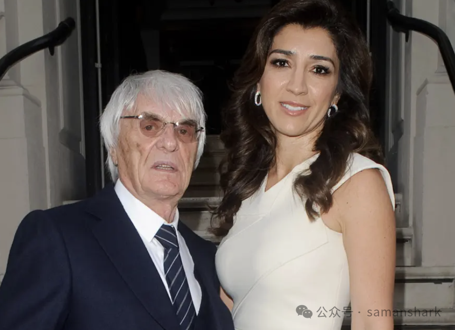
*Bernie Ecclestone(左)*
*前文所提到的Ecclestone毫不掩饰自己对女人的贬低和物化，他曾表示: 女人没有商业价值，女车手在 F1 「永远不会被当真」，「女性应该像其他家用电器一样」穿白色，以便和厨房融为一体，如果老登受时代推动必须要接受女车手，说不定真能提出让她们穿比基尼开车的点子*

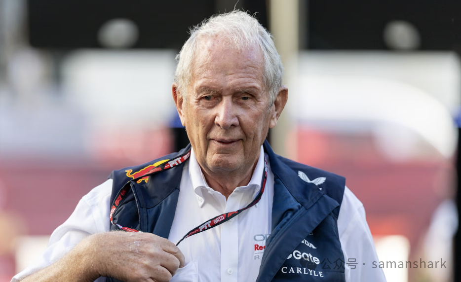
*前红牛顾问Helmut Marko*
*红牛的已退休邪恶老登马尔科拒绝招募女车手，因为女性天性温柔脆弱不适合赛车这样的暴力运动。这也就是F1车队架构封建，要是放在企业，老登早被告去喝茶 ；*

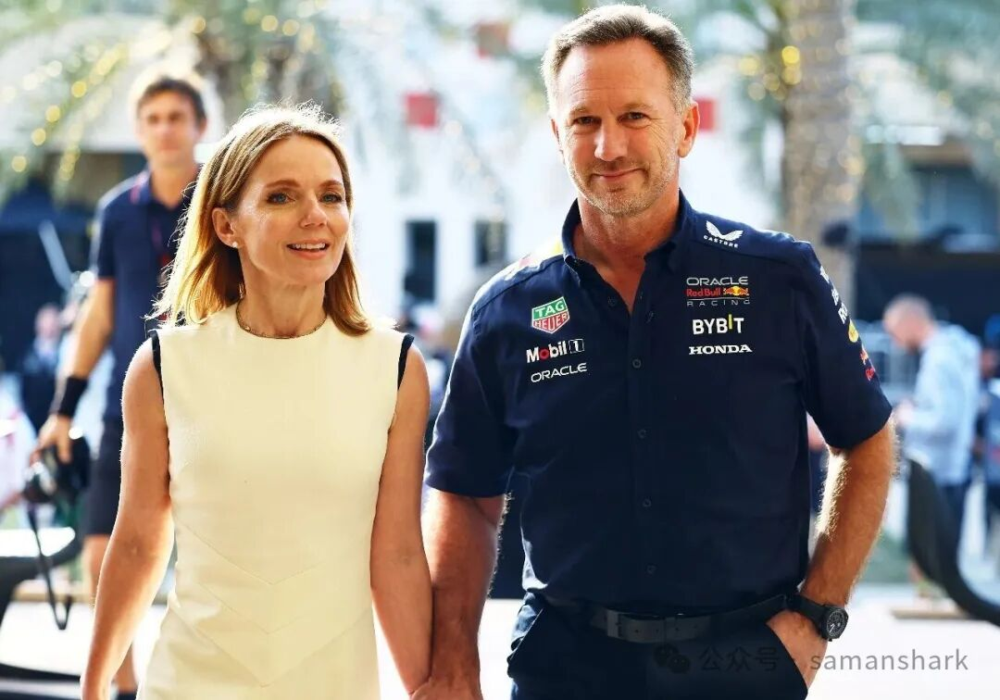
*Christian Horner的妻子是英国辣妹组合Spice Girls里的Geri
人才辈出的红牛还有个前领队霍纳，一把年纪了在车队言语性骚扰女同事，好歹也是个大自身领队，说起话来如精虫上脑的初中生一样令人作呕。*

车手中的典型案例也比比皆是，对女记者的轻视或调情，骚扰赛车女郎，对性骚扰的冷漠和所谓钝感，热衷厌女笑话，点赞Andrew Tate味冲天的厌女博文，等等，哪怕放在乌烟瘴气的好莱坞，随便一件事都能让他们风评走烂，被集体取消，雪藏至少几个月。而在围场，就连马泽平板上钉钉的性骚扰行为都能被当个屁放了，说明这片土壤本身就是有毒的。

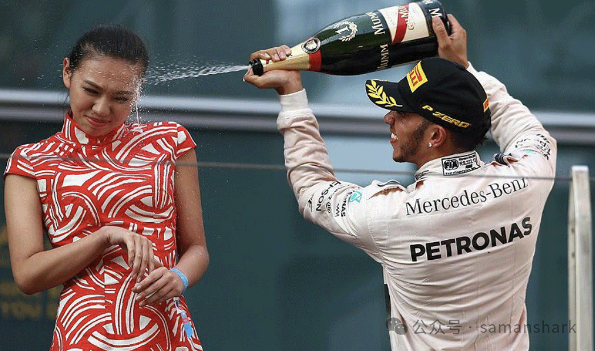
*中国大奖赛上，汉密尔顿向赛车女郎脸上喷香槟*

不幸中的万幸是中国的车迷群体——或许是由于规模不大，并未中此毒，至少在我的沉浸式比烂中国，F1 社群的厌女程度比足球社群好太多了。唯一让人不爽的就是最近不知道从哪儿冒出来的聒噪顺直，只要诺里斯一出现，他们就像被触发底层代码一样说「给」，好像这样简单粗暴地给人贴上一个「gay」的标签能够攻击到对方似的。新科冠军诺里斯身上确实有一点对保守主义钟爱的传统男性气概的消解。和围场其他一天强调二十次自己是男的自己的车也是男的直男哥相比，诺里斯更愿意在公众面前暴露自己的不符合传统男性气质的一面——他情感丰富，说话真实，不惧表露脆弱与羞怯，会在压力过大或者夺冠胜利后哭出声，被围场其他苦大仇深男子形象衬托得格外珍贵。

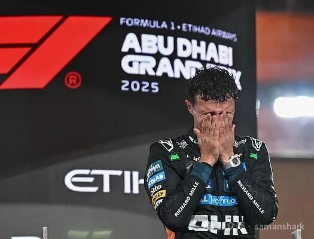
*Lando Norris在获得世界冠军后喜极而泣*

体育世界中的种族主义和厌女恐同常常是心连心手牵手出现的，在F1里顶级车手如果出柜为酷儿，几乎等同于商业自杀——赞助商、车队老板和保守的车迷群体嘴上说得再体面，实际行动可能都不会接受他。车王舒马赫的弟弟，曾效力于威廉姆斯的拉尔夫舒马赫在F1时期有过一段长达 14 年的异性恋婚姻，并有一个孩子，多年后才敢出柜。退役车手尚且如此谨慎，何况现役车手。F1在这方面甚至落后于恐同恐得臭名昭著的男足运动，女足里同性情侣比比皆是，男足里千千万酷儿却依旧不敢出柜。但欧洲的足球联赛好歹在形式上做满了功夫，又是带彩红袖标，又是在骄傲月换彩虹头像的支持酷儿群体，尽管是一大堆都是些花拳绣腿，是也算是在买赎罪券。而F1 官方丝毫不掩饰老保倾向，如今的FIA主席穆罕默德·本·苏拉耶姆直接批评点名批评了当时积极支持酷儿权利的车手：「尼基·劳达和普罗斯特只关心赛车。现在，维特尔骑着彩虹自行车，汉密尔顿热衷于人权，诺里斯谈论心理健康。每个人都有权思考，但对我来说，关键在于我们是否应该一直把我们的信仰强加在体育运动之上。」

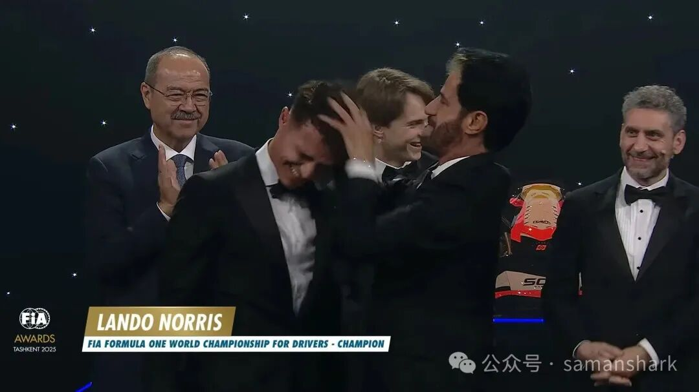
*苏拉耶姆莫名其妙地扯Lando的头发*

2023年苏拉耶姆还主导修订了FIA 规则，明确禁止车手在未经许可的情况下发表「政治、宗教和个人声明」——依旧还是老一套，以中立之名纵容歧视，拒绝进步，抹除酷儿群体的可见度，值得吐槽的是，诺里斯谈论心理问题也被老登点名批评了，老天爷，一项运动能因为说两句「爱你老己」，看两次心理医生就变得不纯粹？要真这样脆弱不看也罢。

###Saudi Pro League！

我对于苏拉耶姆讨厌至极，不仅是因为他这些经典老保套装，还有他本身就是F1虚伪性的缩影。

想要了解苏拉耶姆本人请去看i苏TV的Rick大骂特骂。我只想说说他所代表的体育洗白。

「体育洗白」（Sportswashing）是 21 世纪地缘政治与资本运作的结合。用极其昂贵的体育盛事和顶级球星的汗水，去覆盖、稀释并「洗白」一个国家在人权、法治及社会准则上的负面形象。沙特、卡塔尔、阿联酋是这一领域的大宗师，在欧洲足球世界，早就有中东财团购买曼城、巴黎圣日耳曼、纽卡斯尔联等，成为俱乐部金主爸爸，利用球迷的忠诚度建立国家情感连接。由于C罗加入而变成热门捞金地的沙特联等也是这个逻辑，沙特王储穆罕默德·本·萨勒曼拥有沙特联四大豪门各75%的股份，球星纷纷加入沙特联，代言宣传的是某种国家意志。

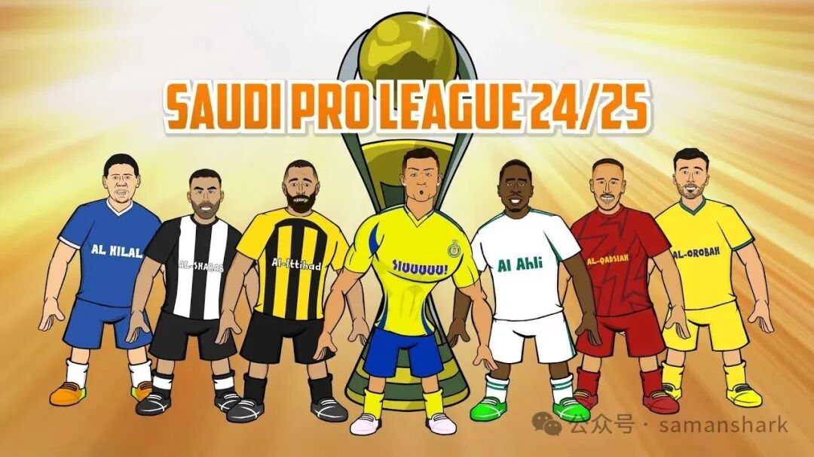
*C罗加入沙特联后，更多的球星纷纷到沙特捞金，钱多活少*

今年的F1有四场在沙特举办的比赛，巴林，吉达，卡塔尔，阿布扎比——由于中东战局，前几场多半会取消——这些分站的举办费通常是欧洲传统赛道的 几倍。而沙特Aramco，卡塔尔航空等国家资本也是 F1 重要的合作伙伴，Aramco甚至是阿斯顿马丁的赞助，F1 的规则制定者、运营者和参赛者，本质上都在拿中东财团的钱，这份钱足以让他们对We Race As One的口号视而不见。

在沙特和阿联酋，同性性行为依旧没去罪化。性少数群体长期生活在被监禁、鞭刑甚至死刑处决的恐惧中。沙特目前已经允许女性开车和进入赛场，但Loujain al-Hathloul这样的想要推动变革的活动家，面临着严苛的禁令且随时可能再次消失。中东的劳工权益问题也一直备受诟病，卡法拉制度堪比现代奴隶制。在2022年的卡特尔世界杯前，有超过6000名南亚劳工因为高温超负荷建造场馆而死，卡塔尔官方辩称是「自然死亡」，但这些劳工大都是支付了巨额招募费才来到卡塔尔，一落地护照就被雇主没收。在卡法拉制度下，没有雇主许可，他们不能辞职也不能离开国家。不知大家是否记得，卡塔尔世界杯期间有一些零星的抵抗，德国队挪威队等进行了不痛不痒的仪式，宽老师克罗斯多次在自己的播客中公开炮轰卡塔尔：劳工权益完全没有保障，这种比赛就不该在那里举办。坎通纳等人也拒绝观看任何一场比赛。

同在2022年，在吉达站赛前十多天，沙特在一天内处决了81人，超过一半的受害者属于沙特长期受到歧视的什叶派少数群体。许多人仅仅是因为参加了反政府的民主抗议活动就被打上恐怖主义标签，并在缺乏公平审判，以及刑讯逼供的情况下被送上断头台。时任 F1 首席执行官多梅尼卡利的态度极其虚伪，他认为留在沙特可以「照亮」人权黑暗面。比赛阴云笼罩，车手们心情沉重，汉密尔顿等人想过罢赛，但是吉达站依旧顺利完赛，满围场的富豪精英们竟无一人敢言。

正如Maya Foa所言，F1这十年的合同实际上是一份洗清血迹的合同，F1的存在给了这种暴行合法性(The 10-year deal F1 has just signed with the kingdom is effectively a contract to sportswash Mohammed bin Salman’s blood-soaked regime)。而这种一边别徽章穿T恤高呼We Race as One，一边用引擎的轰鸣声掩盖一切的行为，让我无论如何也无法信任这项赛事中的任何一个人，无法单纯地虔诚地支持任何一只队伍。

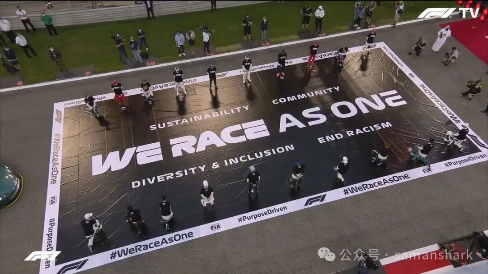

对于F1的经典恶棍，比如出现在爱泼斯坦名单上并总是用一种诡异的讨论自己年幼孩子的老斯特罗尔两口子，比如恶贯满盈的布里亚托利，自然不用多说，每天默念一遍#花布死了#，想要了解的读者请移步其他平台或者豆瓣的大拉表阅读观看车手们的黑历史。

围场上活跃的车手也继承了这项运动的虚伪气质：身为加拿大人的斯特罗尔默默关注臭名昭著的美国ICE；在人权领域活跃多年——无论是不是立人设，君子论迹不论心，且常为巴勒斯坦的人道主义危机摇旗呐喊的汉密尔顿转头就和与他一直以来提倡的所有东西背道而驰的金卡戴珊约会去了。红色软件直男哥整天拿着卡戴珊的情史对汉密尔顿进行「下赛季还开得动吗」警告，我只想问老汉谁能懂你，你和世界最有名的Zionist约会谁懂你。

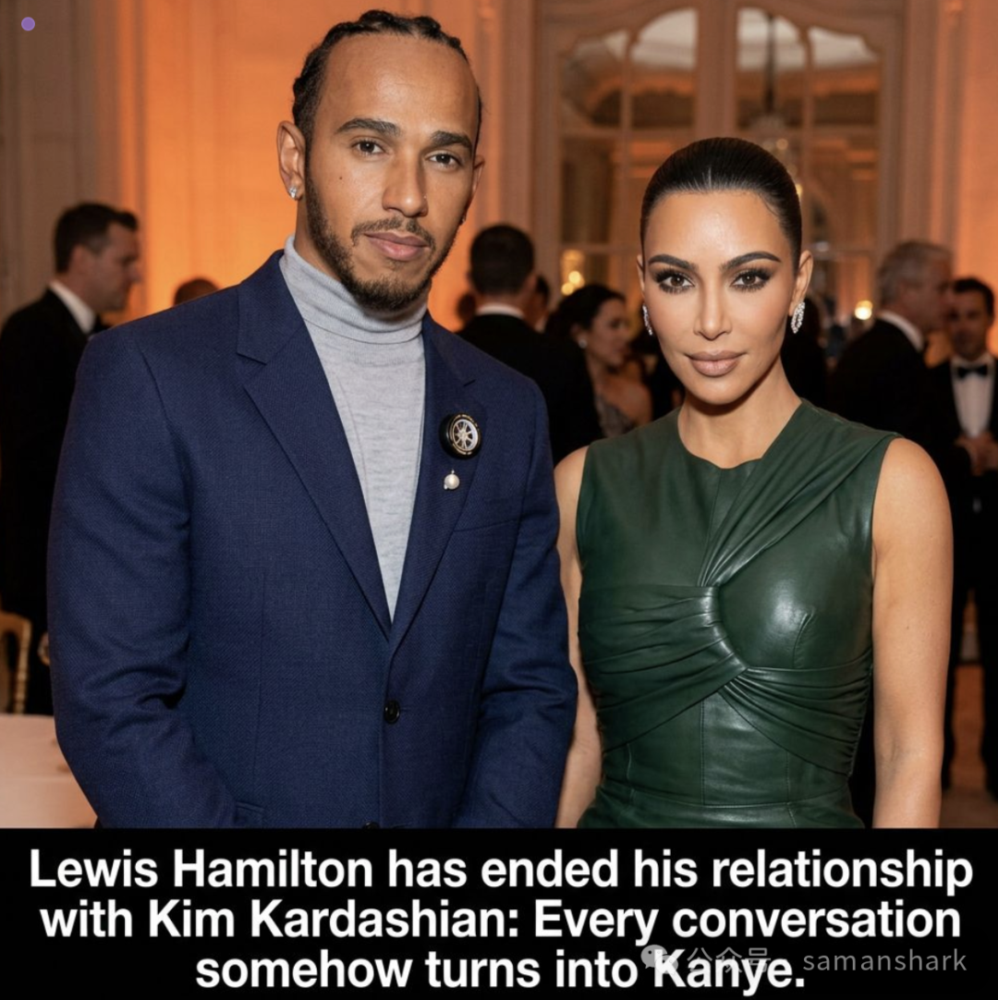
*是meme吧老兄？*

维特尔是一种更诚实的虚伪，他拧巴得很，仿佛是开了15年极高碳排放的赛车又给Aramco挣了几年脏钱后良心不安，开始在赛道旁造蜂箱、捡垃圾、呼吁关注气候危机。他在采访中半开玩笑半较真地说自己就是世界上最大的伪君子。他已经无法逃脱这种生活方式，无法割舍其带来的名利，但他摆出了某种赎罪的姿态，哪怕是螳臂当车，也比大多活在温室里的车手们更诚实一点。

我说大多车手活在温室里，主要是因为他们的阶级脱节，世界里似乎只有赛车与小家——无比保守的价值观。四轮就是「22个巨富开着世界上最贵的车绕圈的比赛」，「比赛」一词甚至都不准确，更像是「演出」，因为从我等凡人的视角来看，如今围场上一大半人如果不开车了就得回去继承家业——诺里斯的父亲是金融界大亨，不到四十岁就财富绝对自由，退休投资去了；新秀博托莱托的父亲是巴西的汽车供应链巨头；维斯塔潘，塞恩斯，安东内利都来自小有名气的赛车世家；更别提斯特罗尔这种巨富家庭。

我等难以望其项背的出生以及围场保守主义的环境让大多数车手接近犬儒主义，只要不影响我开车，世界如何都与我无关。这种精致利己在 2026 年复杂的地缘政治环境下幼稚刺眼，土得掉渣——但不妨碍依旧有对大把热爱浪漫化精英阶层的人吻上去，给车手们贴上「完美」「儒雅」「纯粹」「幸福里长大的小孩」的标签。

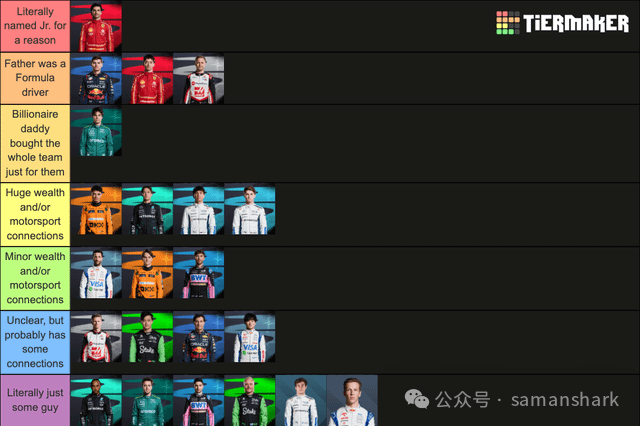
*车手家世大拉表https://www.reddit.com/r/formuladank/comments/1g8zw3q/driver_tier_list_based_on_how_much_of_a_nepo_baby/*

我虽自称维斯塔潘车迷——主要被他的童年创伤吸引，但我也要承认看似心直口快的他也是冷漠的，车迷们调侃他的眼里只有赛车，不像汉密尔顿或维特尔一样谈论社会，我不想说他的这种中立是对强权的默认，更多是他的性格与经历原因，不过他的的确确是一边享受着体育洗白带来的巨额合同，一边又没有承担作为全球偶像的哪怕一点点道德负荷。但他也不是绝对纯粹真空的，他和围场其他顶级车手们几乎全员定居在摩纳哥，除了勒克莱尔这个本地人，其他人多多少少是为了避税，钱在哪里爱就在哪里，当车手们的财富没有进入任何一个国家的公共医疗或教育系统中时，他们口头上所有「社会责任感」就显得幼稚虚伪。

这种看富豪表演的割裂感剥夺了我观看竞技体育最重要的快乐来源——身临其境的替代快感。因此每次看到直男哥替勒克莱尔哀叹「既生瑜何生亮」或者美强惨叙事时我都无动于衷。我深信哪怕从未踏上赛车之路，等待他们的也会是相对衣食无忧的幸福生活，哪怕这辈子都没有赢得世界冠军，他依靠白男身份、摩纳哥户口本和外貌特权获得的商业价值也足以让他成为历史上最有名的赛车手之一了。啥？你说「个人梦想」，你说「热爱」，你说「挑战极限的精神」？我想要感受这些东西的话，有大把奥运会项目和极限挑战等着我去大散同情心，围场里的人上人不缺这点肯定。

##可否道德地观看败坏的比赛

当作为酷儿群体一员的Sam Altman再次向Trump政府捐款投诚时，一大波人卸载了ChatGPT，我也选择使用在比烂大赛中不那么烂的其他AI；当麻辣鸡开始跪舔Trump时，她多年的酷儿乐迷们纷纷烧专辑抵制；当泰勒斯在新专辑表现出亿万富翁的脱节时我都hate-listen了一个月，为脱粉的歌迷们拍手叫好；但我为什么还在看小车跑圈，原因很简单——我喜欢看草台班子，没有比精装修高端战线中忽然出现的原始降智桥段更具有现代幽默性，更大炮轰蚊子的了。

想象你让库克，Sam Altman和马斯克帮你拼多多砍一刀，然后他们拿着千元机一顿操作最后下载了20个莫名其妙的绑定软件还不知道如何卸载——看F1就是这种感觉。

F1看起来如此煞有介事高精尖，细节之处却毫不符合精英想象，法拉利的官腔沟通让社会经验为零的中学生看了都皱眉，木瓜原则放在十年前的二胎家庭里都是要被淘汰的落后育儿经，记者提的鸡毛蒜皮的问题让人怀疑围场内外到底还有没有心智成熟的人，FIA，车手们和围场社群心安理得展现出的散漫笨拙（或许专业主义吸烟刻肺的梅奔除外）犹如一种安慰剂：加油吧你能行的，世界没有你想的那么严格，连法拉利都如此散漫，你装一装也能上了。

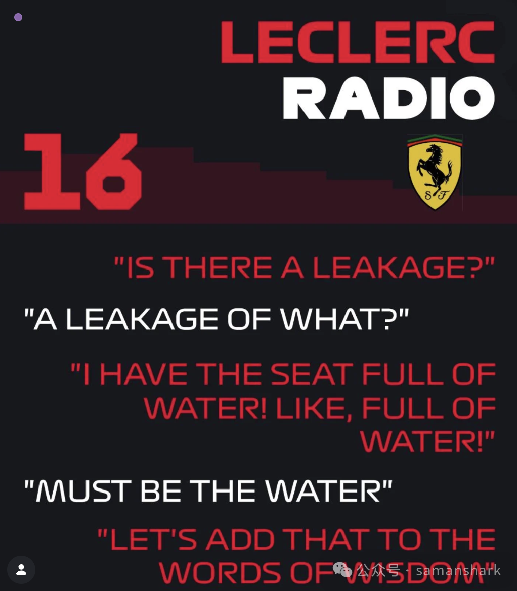
*法拉利的人机沟通*

彩蛋：F1也是有某种慰安功能，在F1社群里我能毫无负担地物化，充满恶意地凝视。很多人追爱豆是在追一种人设，男团女团们依旧具有商品属性，但只要稍微了解了K-pop产业的血汗内幕，在面对同属于受害者链条的年轻爱豆时就无法毫无道德负担地对他们进行彻底非人化，进行编排与想象

有人很地狱地说足球产业在物化球员，转会市场是如今唯一能够正当购买黑人的途径。但由于足球覆盖面极广，扎根社群极深，依旧存在一些人性时刻，我也无法做到真正的凝视。

但F1不一样了，这是一群百分之一百的天龙人，我在wearechecking等盗版链接看比赛时心安理得，以下犯上物化之凝视之放在AO3淫乱文章中赛博玩弄之时毫无心理负担。

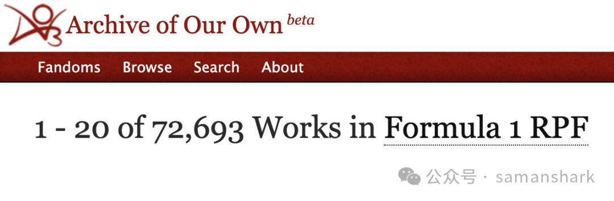
*非常可怕的数字
如果你有同样的困惑——比如你是一个C罗球迷，在知道他是一个疑似强奸犯后却出于沉没成本依旧不愿放手，你的热爱和你的道德在内斗，那么你可以试试这个方法，去红白网站阅读几篇嬷他的文章，或许，我只是说或许，你会发现但他成为纳入性行为的接收方时，你对他的复杂情感不过是你对自己的延迟审视，他贬值了，你成为了中心。*

当然，当然，当然，F1还有更为丰富的娱乐科技经济价值，但我不想为其专门写篇文章。

让我们停止在体育赛事或者任何庞大的集体中寻求纯粹，纯粹不存在。

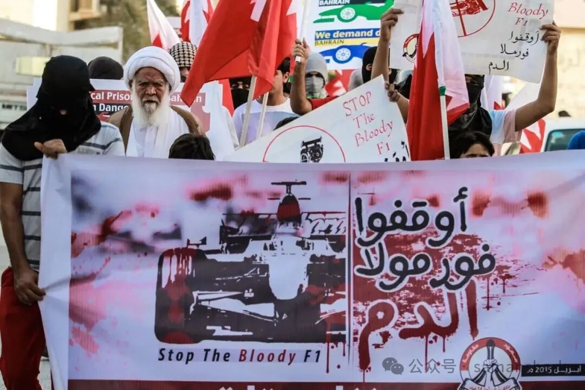

**参考资料 / References**

* Saudi Arabia: Mass execution of 81 men shows urgent need to abolish the death penalty https://www.amnesty.org/en/latest/news/2022/03/saudi-arabia-mass-execution-of-81-men-shows-urgent-need-to-abolish-the-death-penalty/

* F1 faces calls to quit Saudi Arabia while prisoner’s family asks Hamilton to help https://www.theguardian.com/sport/2022/mar/24/f1-saudi-arabia-lewis-hamilton-abdullah-al-howaiti-human-rights

* Horner shares hilarious anecdote about Tsunoda: 'Did Yuki really say that?' https://www.gpblog.com/en/news/anecdote-horner-on-tsunoda.html

* Rick'sF1Addiction https://www.youtube.com/@RicksF1Addiction

* Accusations of Formula 1 ‘sportswashing’ with Saudi Arabian Grand Prix https://reprieve.org/uk/2023/03/19/formula-1-accused-of-sportswashing-a-blood-soaked-regime-with-saudi-arabian-grand-prix-2/

